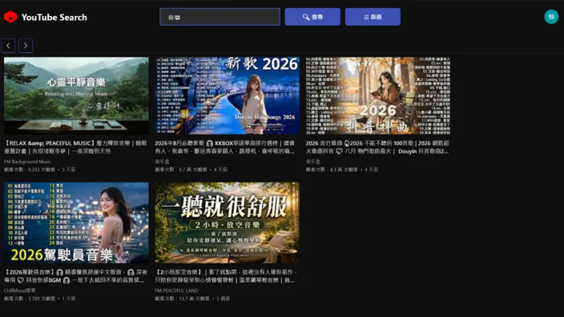

# YouTube Desktop Application

以 **C# / WPF** 開發的 YouTube 桌面應用程式，整合 **YouTube Data API v3** 與 **Google OAuth 2.0**，實作影片搜尋、播放、訂閱、評分、留言、播放清單與會員相關功能。

本專案除了功能實作，也著重於桌面應用程式的架構設計，將 **UI、Presenter、API 存取與 HTTP 通訊層**進行職責拆分，並實作可重複使用的 WPF 元件、Navigation Service、OAuth 驗證流程與自訂 HTTP Utility。

> A WPF desktop client integrating YouTube Data API v3, OAuth 2.0, reusable UI components, and layered application architecture.

---

## 專案功能

### 影片搜尋

使用關鍵字搜尋 YouTube 內容，並以影片卡片方式呈現搜尋結果。

搜尋結果包含：

- 影片縮圖
- 影片標題
- 頻道名稱
- 發布時間
- 觀看次數

並支援搜尋條件：

- 內容類型
- 上傳日期
- 影片長度
- 影片分類

---

### 搜尋篩選

搜尋篩選功能獨立實作為 WPF `UserControl`。

支援：

- 影片 / 頻道 / 播放清單
- 上傳日期
- 影片長度
- YouTube Video Category

元件透過 `DependencyProperty` 與 `ICommand` 對外溝通，降低元件與外層頁面的耦合。

---

### 分頁功能

搜尋結果使用獨立的 Pagination 元件處理分頁。

支援：

- 上一頁
- 下一頁
- 快速向前 / 向後跳頁
- 指定頁碼
- 每頁顯示筆數切換

分頁邏輯透過：

```text
IPaginationView
IPaginationPresenter
```

將 UI 與分頁邏輯分離。

---

### 影片詳細頁

點擊搜尋結果後，可進入影片詳細頁。

頁面顯示：

- YouTube 影片播放器
- 影片標題
- 影片描述
- 頻道資訊
- 發布日期
- 觀看次數
- 按讚數
- 訂閱狀態
- Like / Dislike 狀態

影片播放透過 **Microsoft WebView2** 嵌入 YouTube Player。

---

### YouTube 帳號互動

透過 OAuth 2.0 授權後，可直接從桌面應用程式操作 YouTube 帳號功能。

目前包含：

- Like
- Dislike
- 取消評分
- 訂閱頻道
- 取消訂閱

---

### 播放清單

YouTube API Layer 中實作 Playlist 與 PlaylistItem 相關操作，包括：

- 取得播放清單
- 取得播放清單內影片
- 將影片加入播放清單
- 從播放清單移除影片

---

### 留言功能

整合 YouTube Comment API，支援：

- 取得影片留言
- 取得回覆留言
- 新增留言
- 回覆留言
- 修改留言
- 刪除留言

---

# 系統架構

本專案將 WPF UI、Presentation Logic、YouTube API 存取以及 HTTP 通訊拆分為不同職責。

```text
┌───────────────────────────────────────┐
│                WPF UI                 │
│                                       │
│ MainWindow / Pages / UserControls     │
└───────────────────┬───────────────────┘
                    │
                    │ Command / View Contract
                    ▼
┌───────────────────────────────────────┐
│             Presenter Layer           │
│                                       │
│ SearchPresenter                       │
│ PaginationPresenter                   │
│ CommentPresenter                      │
│ VideoDetail                           │
└───────────────────┬───────────────────┘
                    │
                    │ DTO / Request
                    ▼
┌───────────────────────────────────────┐
│            YouTube API Layer          │
│                                       │
│ YoutubeContext                        │
│ ├─ SearchContext                      │
│ ├─ VideoContext                       │
│ ├─ PlaylistContext                    │
│ ├─ PlaylistItemContext                │
│ ├─ CommentContext                     │
│ ├─ SubscriptionContext                │
│ └─ ChannelContext                     │
└───────────────────┬───────────────────┘
                    │
                    ▼
┌───────────────────────────────────────┐
│              HTTP Utility             │
│                                       │
│ IHttpRequest                          │
│ HttpUtility                           │
│ BaseHttpHandler                       │
│ Interceptor                           │
└───────────────────┬───────────────────┘
                    │
                    │ OAuth 2.0 Bearer Token
                    ▼
┌───────────────────────────────────────┐
│          YouTube Data API v3          │
└───────────────────────────────────────┘
```

---

# 搜尋流程

影片搜尋流程如下：

```text
User
 │
 │ 輸入搜尋條件
 ▼
MainWindowContext
 │
 │ SearchRequestDTO
 ▼
NavigationService
 │
 ▼
VideoSearch
 │
 ▼
VideoSearchContext
 │
 │ SearchRequest
 ▼
SearchPresenter
 │
 ▼
YoutubeContext.Search
 │
 ▼
HttpUtility
 │
 │ Authorization Header
 ▼
YouTube Data API v3
 │
 ▼
API Response
 │
 ▼
SearchPresenter
 │
 │ VideoCardDTO
 ▼
VideoSearchContext
 │
 ▼
VideoCard UserControl
```

透過此方式，UI 不需要直接處理 YouTube API Endpoint 或 HTTP Request 細節。

---

# 專案結構

```text
YoutubeApplication
│
├── Youtube
│   │
│   ├── Components
│   │   ├── PaginationComponent
│   │   ├── PlayListComponent
│   │   ├── SearchFilterComponent
│   │   ├── VideoCardComponent
│   │   └── Comment Components
│   │
│   ├── Contracts
│   │   ├── SearchContract
│   │   ├── PaginationContract
│   │   └── CommentContract
│   │
│   ├── Presenters
│   │   ├── SearchPresenter
│   │   ├── PaginationPresenter
│   │   └── CommentPresenter
│   │
│   ├── Converters
│   │
│   ├── Utility
│   │   ├── RelayCommand
│   │   ├── WebView2Helper
│   │   └── Service
│   │       ├── INavigationService
│   │       └── NavigationService
│   │
│   └── Views
│       ├── MainWindow
│       └── Pages
│
├── YoutubeAPI
│   ├── Auth
│   ├── Search
│   ├── Video
│   ├── Playlist
│   ├── PlaylistItem
│   ├── Comment
│   ├── Subscription
│   └── Channel
│
└── HTTP_Utility
    ├── IHttpRequest
    ├── HttpUtility
    ├── BaseHttpHandler
    └── Interceptor
```

---

# 架構設計重點

## API Layer 封裝

YouTube API 呼叫不直接寫在 WPF Page 中，而是集中於 `YoutubeAPI` 專案。

透過 `YoutubeContext` 統一提供：

```text
Search
Video
Playlist
PlaylistItem
Comment
Subscription
Channel
```

等 API Context。

這樣 UI 與 Presenter 不需要知道實際 Endpoint 的細節。

---

## 自訂 HTTP Utility

另外建立 `HTTP_Utility` 封裝 `HttpClient`。

透過 `IHttpRequest` 統一提供：

```text
GET
POST
PUT
PATCH
DELETE
```

並支援：

- Query Parameter
- JSON Serialization
- JSON Deserialization
- Multipart Request
- Generic Response Mapping

避免每一個 API Context 重複撰寫 `HttpClient` 邏輯。

---

## Interceptor

使用自訂 `DelegatingHandler` 建立 Request Interceptor。

Request 送出前會先經過：

```text
HttpUtility
    ↓
BaseHttpHandler
    ↓
Interceptor
    ↓
加入 Authorization Header
    ↓
YouTube API
```

因此 OAuth Token 處理不需要散落在每一個 API method 中。

---

## OAuth 2.0

YouTube 帳號相關功能透過 Google OAuth 2.0 取得授權。

流程：

```text
Application
    ↓
Google Authorization Endpoint
    ↓
使用者授權
    ↓
localhost Callback
    ↓
Authorization Code
    ↓
Google Token Endpoint
    ↓
Access Token
    ↓
Refresh Token
```

Access Token 會用於需要帳號權限的 YouTube API Request。

---

## Presenter / View Contract

部分功能採用 Presenter 與 View Contract 分離。

例如搜尋：

```text
VideoSearchContext
        │
        │ implements
        ▼
   ISearchView
        ▲
        │
 SearchPresenter
```

Presenter 不直接依賴實際 WPF Page，而是依賴 View Interface。

例如：

```csharp
interface ISearchView
{
    void SearchResponse(List<VideoCardDTO> response);
}
```

此方式可以降低 UI 與 Presentation Logic 的耦合。

---

## 可重複使用的 WPF 元件

專案中將多個 UI 功能抽成獨立 `UserControl`：

```text
VideoCard
Pagination
SearchFilter
Playlist
Comment
ReplyComment
```

元件透過 WPF Binding 機制與外部溝通，包括：

- `DependencyProperty`
- `ICommand`
- Data Binding
- `IValueConverter`
- XAML Behaviors

讓 UI 元件能獨立使用，而不需要知道父層 Page 的實作細節。

---

## Navigation Service

頁面切換不直接寫死於每一個 View。

透過：

```text
INavigationService
       ↓
NavigationService
       ↓
WPF Frame
```

管理 Page Navigation。

Page 可以實作：

```csharp
INavigationAware
```

並透過：

```csharp
void OnNavigatedTo(object[] parameter)
```

接收 Navigation Parameter。

例如點擊影片後：

```text
VideoCard
   ↓
VideoSearchContext
   ↓
NavigationService
   ↓
VideoDetail
   ↓
videoId
```

---

## DTO 分離

YouTube API Response Model 不直接完全綁定至 UI。

搜尋結果會經過：

```text
YouTube API Model
        ↓
SearchPresenter
        ↓
VideoCardDTO
        ↓
VideoCardContext
        ↓
VideoCard
```

藉此降低 UI 與第三方 API Response Structure 之間的耦合。

---

# 使用技術

| 類別 | 技術 |
|---|---|
| Language | C# |
| Desktop UI | WPF / XAML |
| API | YouTube Data API v3 |
| Authentication | Google OAuth 2.0 |
| REST API | YouTube Data API Integration |
| HTTP | HttpClient |
| HTTP Pipeline | DelegatingHandler / Interceptor |
| Video Player | Microsoft WebView2 |
| Binding | WPF Data Binding |
| Command | ICommand / RelayCommand |
| Property Notification | PropertyChanged.Fody |
| Mapping | AutoMapper |
| UI Behavior | Microsoft.Xaml.Behaviors.Wpf |
| Architecture | Presenter / View Contract |
| Navigation | Custom Navigation Service |

---

# 專案設計理念

這個專案最初是以 YouTube API 串接與 WPF UI 練習為目的。

隨著功能逐漸增加，開始出現：

- Page 邏輯過多
- API 呼叫與 UI 耦合
- Navigation 分散
- HTTP Request 重複
- UserControl 無法重複使用
- Authentication 邏輯散落

因此逐步將專案重構為：

```text
UI
 ↓
Presenter
 ↓
API Layer
 ↓
HTTP Utility
 ↓
External API
```

並將共用功能抽象為：

```text
Contract
DTO
Navigation Service
Reusable UserControl
Interceptor
```

讓專案從單純的 API 練習逐步發展成一個以架構與可維護性為重點的桌面應用程式。

---

# 目前完成項目

- [x] YouTube 關鍵字搜尋
- [x] 搜尋條件篩選
- [x] 搜尋結果 Pagination
- [x] Video Card 元件
- [x] Video Detail
- [x] WebView2 YouTube Player
- [x] 影片觀看數
- [x] Like / Dislike
- [x] Channel Subscription
- [x] Playlist API
- [x] Playlist Item API
- [x] Comment API
- [x] OAuth 2.0
- [x] Access Token / Refresh Token
- [x] HTTP Utility
- [x] Request Interceptor
- [x] Navigation Service
- [x] Reusable WPF Components

---

# 後續重構規劃

目前部分物件仍直接建立，例如：

```csharp
new SearchPresenter(...)
new YoutubeContext()
new NavigationService(...)
```

下一階段將導入 Dependency Injection，將物件建立集中於 Composition Root。

預計方向：

```text
Application
     ↓
Composition Root
     ↓
DI Container
     │
     ├── Presenter
     ├── NavigationService
     ├── Youtube API Services
     ├── HTTP Services
     └── UI Components
```

預期改善：

- 降低物件建立耦合
- 改善 Dependency Management
- 提升可測試性
- 方便替換 Implementation
- 管理 Singleton / Transient Lifetime
- 讓 View 不需要自行建立 Presenter

---

# Demo

### 專案介面

<p align="center">
  
</p>

> 後續將補充搜尋、篩選、影片播放、訂閱與播放清單等功能操作畫面。

---

# 學習重點

透過這個專案實際練習：

- WPF Desktop Application 開發
- XAML Data Binding
- ICommand
- DependencyProperty
- UserControl 元件化
- Presenter Pattern
- Interface-based Design
- DTO Mapping
- REST API Integration
- OAuth 2.0
- HttpClient
- DelegatingHandler
- Request Interceptor
- Navigation Service
- WebView2
- Third-party API Integration
- Application Refactoring

---

# Author

**Amber Cheng**

此專案為個人軟體開發與架構設計練習作品，主要聚焦於：

**C#、WPF、REST API Integration、OAuth 2.0、Desktop Application Architecture 與第三方 API 串接。**
